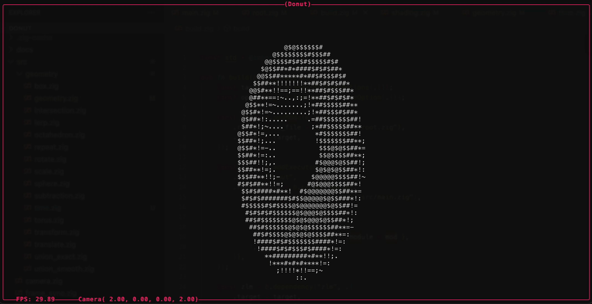
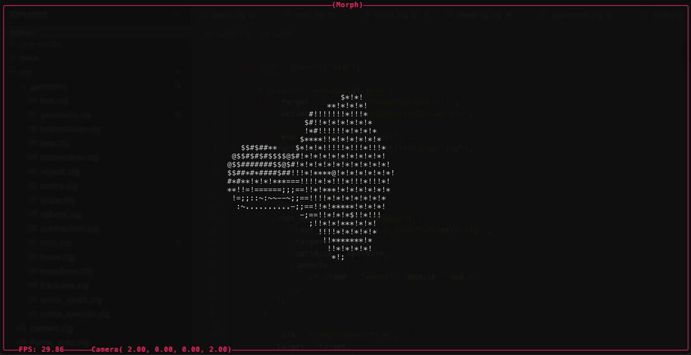
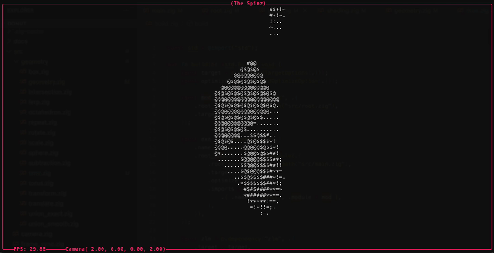

# Donut 🍩

A [ray-marched](https://en.wikipedia.org/wiki/Ray_marching) 3D renderer in your
terminal, written in [Zig](https://ziglang.org/) and inspired by
[akhileshthite/3d-donut](https://github.com/akhileshthite/3d-donut).

<p align="center">
  
</p>

## Requirements

- [Zig](https://ziglang.org/) 0.16.0 (pinned in `mise.toml`)

## Run / Test / Format

```bash
# build
mise run build
# test
mise run test
# check format
mise run fmt
# auto format
mise run fix
```

## Configuration

Everything on screen (the scenes, the lighting, the camera limits, the march
quality) comes from a JSONC file (JSON plus `//` and `/* */` comments):

```bash
donut my-scenes.jsonc
donut --help
```

With no argument the configuration embedded in the binary is used. That embedded
copy is [`src/default.jsonc`](./src/default.jsonc), which is a commented, working
example of every section below; start by copying it.

Comments are the only extension: trailing commas are rejected, and so are
duplicate keys. Comments are blanked rather than deleted before parsing, so a
syntax error names the line and column of the file you actually wrote:

```
donut: scenes.jsonc: line 4, column 14: SyntaxError
```

Each of `"render"`, `"shading"`, `"camera"` and `"ui"` is optional and every key
within them falls back to the value shown here, so a file containing nothing but
`"scene"` is valid.

```jsonc
{
  "render": {
    "target_fps": 30.0,      // must be greater than 0
    "max_steps": 80,         // ray marching iterations per pixel
    "max_distance": 100.0,   // give up on a ray past this
    "surface_distance": 0.01 // how close counts as a hit
  },

  "shading": {
    "gamma": 2.4,
    "light": [1.0, -1.0, -1.0], // normalized on load
    "lut": ".,-~:;=!*#$@"       // dark to light
  },

  "camera": {
    "look_at": [0.0, 0.0, 0.0],
    "distance": { "default": 2.0, "min": 0.1, "max": 10.0, "step": 0.1 },
    "theta": { "default": 0.0, "step": 0.1 }, // min/max default to ±floatMax
    "phi": { "default": 1.57, "min": 0.1, "max": 3.04, "step": 0.1 }
  },

  "ui": {
    "accent": 5 // terminal palette index for the border and status text
  }
}
```

### Scenes

`"scene"` is an array and needs at least one entry; `t` cycles through them in
file order.

```jsonc
{
  "scene": [
    {
      "name": "Donut",
      "geometry": {
        "type": "spinx",
        "rate": 0.001,
        "geometry": {
          "type": "translate",
          "direction": [0.0, 0.05, 0.0],
          "geometry": { "type": "torus", "inner": 0.45, "outer": 1.0 }
        }
      }
    }
  ]
}
```

A `geometry` is a tree of signed distance functions. `type` picks the shape or
operator and every other key is one of its parameters. A typo in either is an
error naming the path that holds it, not a silently ignored setting.

Operators nest through `geometry`; combinators put a list of children under that
same key. Shallow trees read fine on one line:

```jsonc
{
  "name": "Marching Octahedrons",
  "geometry": { "type": "walk", "direction": [0.00025, 0.0, 0.0],
    "geometry": { "type": "repeat", "spacing": 1.0,
      "geometry": { "type": "spinx", "rate": 0.001,
        "geometry": { "type": "octahedron", "size": 0.25 } } } }
}
```

**Shapes** take no child:

| `type`       | Parameters                    |
| :----------- | :---------------------------- |
| `box`        | `dimensions`                  |
| `box_frame`  | `dimensions`, `thickness`     |
| `octahedron` | `size`                        |
| `sphere`     | `radius`                      |
| `torus`      | `inner`, `outer`              |

**Operators** wrap a single child under `geometry`:

| `type`        | Parameters                                          |
| :------------ | :-------------------------------------------------- |
| `rotatex`     | `angle`                                             |
| `rotatey`     | `angle`                                             |
| `rotatez`     | `angle`                                             |
| `spinx`       | `rate` (radians per millisecond)                    |
| `spiny`       | `rate`                                              |
| `spinz`       | `rate`                                              |
| `translate`   | `direction`                                         |
| `walk`        | `direction` (scaled by time)                        |
| `scale`       | `amount`                                            |
| `repeat`      | `spacing` (tiles the child through all space)       |
| `transform`   | `matrix` (4 rows of 4 numbers)                      |
| `time_offset` | `duration` (shifts the child's clock)               |
| `lerp`        | `start`, `stop`, `time_scale`, `ease`, `mode`       |

`lerp` slides its child between two points; `ease` is one of `linear`, `smooth`,
`smoother` and `mode` is `loop` or `ping_pong`.

**Combinators** take a list of children under `geometry`, one or more:

| `type`          | Parameters                                        |
| :-------------- | :------------------------------------------------ |
| `union_exact`   | none                                              |
| `union_smooth`  | `smooth` (blend radius)                           |
| `intersection`  | none                                              |
| `subtraction`   | none (carves every later child out of the first)  |

```jsonc
{ "type": "union_exact", "geometry": [
    { "type": "sphere", "radius": 1.0 },
    { "type": "box", "dimensions": [1.0, 1.0, 1.0] },
    { "type": "torus", "inner": 0.4, "outer": 1.0 }
] }
```

Order only matters for two of them. `union_exact` and `intersection` are `min`
and `max` folds, so shuffling the list cannot change the surface. `subtraction`
is directional: the first child is the solid, every later one is a tool cut out
of it. `union_smooth` blends left to right and its blend is not associative, so
reordering three or more children is a visible change.

Vectors are three-element arrays and numbers may be written as integers
(`"rate": 0`); a literal too large to be a finite `f64` is a type error rather
than a silent infinity. A missing parameter is an error too, not `undefined`
memory, and both kinds accumulate a path:
`scene[0].geometry.geometry: unknown geometry type "torrus"`. Nesting is capped
at 64 levels so a malformed file cannot smash the stack, and a combinator with an
empty child list is rejected rather than rendering nothing.

The `type` vocabulary is derived from the code by reflection, so a new shape added
to `Geometry` is configurable with no change to the parser.

## Interactive Commands

| Key            |                       Action |
| :------------- | ---------------------------: |
| `wasd`         |    orbit camera around scene |
| `z`            |                      zoom in |
| `shift+z`      |                     zoom out |
| `t`            |            toggle next scene |
| `space-bar`    |             pause animations |
| `r`            | reset the camera and unpause |
| `q` / `ctrl+c` |                         quit |

## Other Examples

<p align="center">
  
  
</p>

# References

- [Signed Distance Functions](https://iquilezles.org/articles/distfunctions/)
