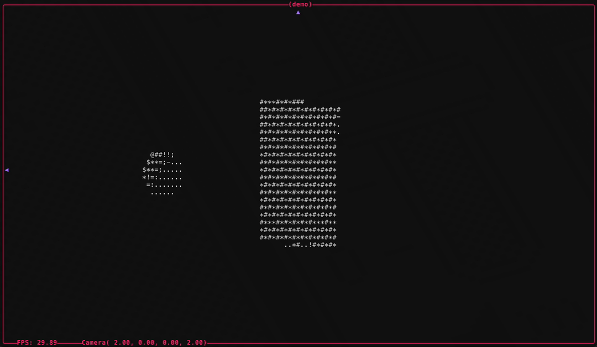

# Donut 🍩

A [ray-marched](https://en.wikipedia.org/wiki/Ray_marching) 3D renderer in your
terminal, written in [Zig](https://ziglang.org/) and inspired by
[akhileshthite/3d-donut](https://github.com/akhileshthite/3d-donut).

<p align="center">
  
</p>

## ⚙️ Requirements

- [Zig 0.15.1](https://ziglang.org/download/0.15.1/release-notes.html)

## 🚀 Run / Test / Format

```bash
# build
zig build run
# test
zig build test
# format
zig fmt .
```

## 🎮 Interactive Commands

| Key         |                    Action |
| :---------- | ------------------------: |
| `wasd`      | obrit camera around scene |
| `z`         |                      zoom |
| `shift+z`   |                  zoom out |
| `space-bar` |          pause animations |
| `r`         |               reset scene |
| `q`         |                      quit |

# 📚 References

- [Signed Distance Functions](https://iquilezles.org/articles/distfunctions/)
